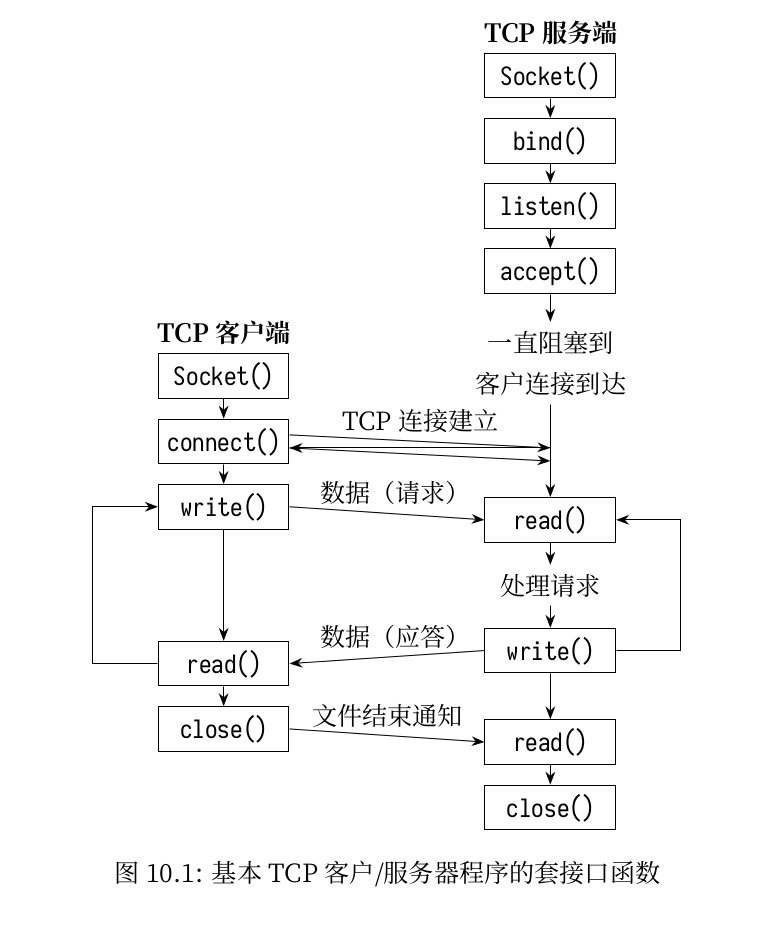

# NetLab
2020秋计网实验

# 设计思路



从此图可以看出客户端与服务器端建立连接到结束的过程。

假设此时服务器端是单线程的，只能接受一个客户端。则这次过程可以抽象为以下几个函数：

```C++
// 包括socket(),bind(),listen(),accept()
// 初始化阶段，服务器需要建立完毕，调用accept函数，等待客户端的连接。
serverInit();
/*socket() 函数的作用就是生成一个用于通信的套接字文件描述符 sockfd(socket() creates an endpoint for communication and returns a descriptor)。这个套接字描述符可以作为稍后 bind() 函数的绑定对象。

服务程序通过分析配置文件，从中解析出想要监听的地址和端口，再加上可以通过 socket() 函数生成的套接字 sockfd，就可以使用 bind() 函数将这个套接字绑定到要监听的地址和端口组合”addr:port” 上。绑定了端口的套接字可以作为 listen() 函数的监听对象。
绑定了地址和端口的套接字就有了源地址和源端口 (对服务器自身来说是源)，再加上通过配置文件中指定的协议类型，五元组中就有了其中 3 个元组。


listen() 函数就是监听已经通过 bind() 绑定了 addr+port 的套接字的。监听之后，套接字就从 CLOSE 状态转变为 LISTEN 状态，于是这个套接字就可以对外提供 TCP 连接的窗口了。

accpet() 函数的作用是读取已完成连接队列中的第一项 (读完就从队列中移除)，并对此项生成一个用于后续连接的套接字描述符，假设使用 connfd 来表示。有了新的连接套接字，工作进程 / 线程 (称其为工作者) 就可以通过这个连接套接字和客户端进行数据传输，而前文所说的监听套接字 (sockfd) 则仍然被监听者监听。
*/

// 包括socket(),connect()
/*connect()函数则用于向某个已监听的套接字发起连接请求，也就是发起 TCP 的三次握手过程。从这里可以看出，连接请求方 (如客户端) 才会使用 connect()函数，当然，在发起 connect()之前，连接发起方也需要生成一个 sockfd，且使用的很可能是绑定了随机端口的套接字。既然 connect()函数是向某个套接字发起连接的，自然在使用 connect()函数时需要带上连接的目的地，即目标地址和目标端口，这正是服务端的监听套接字上绑定的地址和端口。同时，它还要带上自己的地址和端口，对于服务端来说，这就是连接请求的源地址和源端口。于是，TCP 连接的两端的套接字都已经成了五元组的完整格式。
*/
clientInit();
```


[学习0](https://blog.csdn.net/lvyuan30276/article/details/50458572)

[学习1](https://www.junmajinlong.com/coding/tcp_socket/)